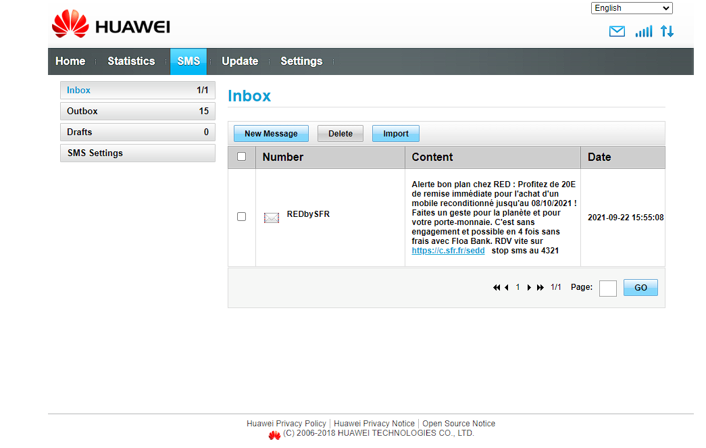

# sms-handler
### Handle SMS from Huawei E3372

I you have a Huawei E3372 modem, you know that it can be flooded with useless SMS like the one bellow.

I created this tool to regularly check for SMS and delete them. I decided afterwards to add a feature to send an SMS.



## How to install ?

```shell
$ sudo apt update
$ sudo apt install libssl-dev
$ git clone https://github.com/galateeobservatory/sms-handler.git
$ cd sms-handler
$ cargo build --release
```

The executable can be found in the `target/release` folder.

## How to use it ?

Send an SMS:

```shell
$ ./sms-handler --send [phone_number] "SMS from Huawei E3372"
```

List all received SMS:

```shell
$ ./sms-handler --list received
```

List all sent SMS:

```shell
$ ./sms-handler --list sent
```

Clean all inbox and outbox SMS:

```shell
$ ./sms-handler --clean
```